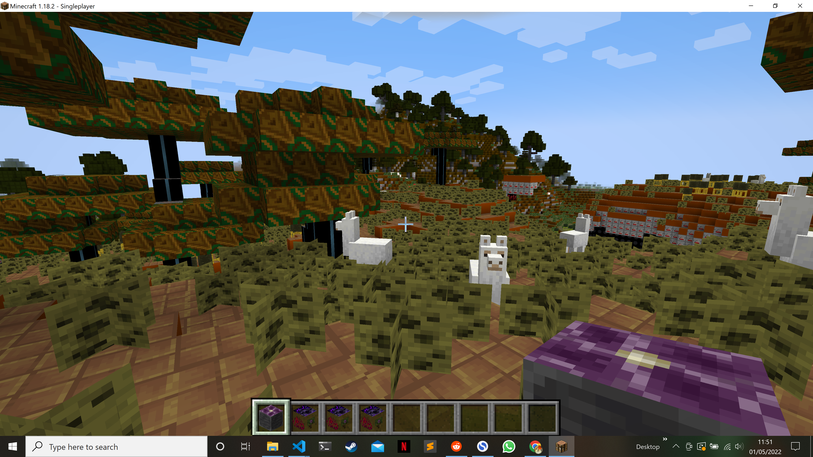

# Simple Minecraft texture randomiser
Create a Minecraft texture pack for a given version by randomly reordering the png file names in /textures/block

## Dependencies 
* Currently only Windows compatible until I sort out file paths properly
* Python 3x. Download: https://www.python.org/downloads/

## Running the script
     python .\mc_random_tp.py -d C:\Users\<user_name>\AppData\Roaming\.minecraft\versions\<required_version> -f 8

## Arguments
    -h --help # display help text and exit
    -d --directory # [Required] Mincraft verison directory to create the texture pack against
    -f --format # [Optional] Pack format to use for the selected Minecraft version. defaults to 8 for versions 1.18+

| Pack format | Minecraft version |
|-------------|-------------------|
| 1	          | 1.6.1 – 1.8.9     |
| 2	          | 1.9 – 1.10.2      |
| 3	          | 1.11 – 1.12.2     |
| 4	          | 1.13 – 1.14.4     |
| 5	          | 1.15 – 1.16.1     |
| 6	          | 1.16.2 – 1.16.5   |
| 7	          | 1.17 - 1.17.1     |
| 8	          | 1.18+             |

